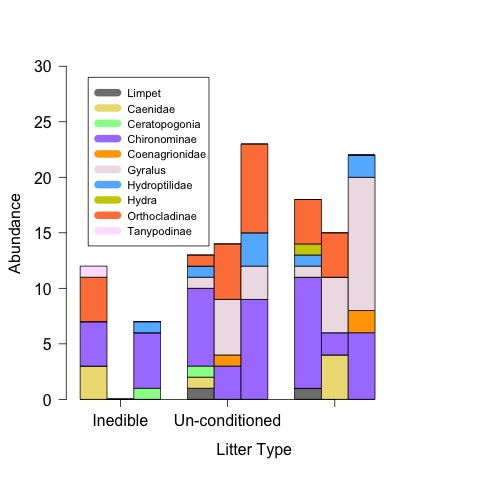
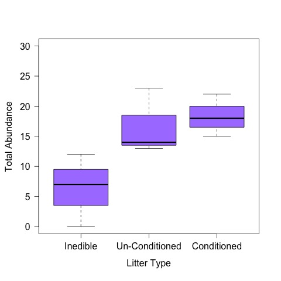

# Analysis of the bug data from the litter habitat experiment 
## Metadata

### File created 

* 22 May 2017

### Modified

## Description

These analyses are to evaluate the community differences of the macroinvertebrates on the different litter types in the litter habitat experiment

The description of the experiment can be found in [https://github.com/KennyPeanuts/litter_habitat_subsidy/blob/master/lab_notebook/habitat_setup_sp2017.md](https://github.com/KennyPeanuts/litter_habitat_subsidy/blob/master/lab_notebook/habitat_setup_sp2017.md)

## Import Data
### Import Data Frame
    bugs <- read.table("./data/bugs_2017.csv", header = T, sep = ",")
    
### Import Matrix
    bug.mat <- as.matrix(read.table("./data/bugs_matrix_2017.csv", header = T, sep = ","))
    
## Matrix Analysis

### Remove Oligochaets 

The oligochates were not reliably sampled so they are removed from the dataset

    bug.mat.wormless <- bug.mat[, -9]

### Plot of relative abundance
    
    par(las = 1)
    barplot(t(bug.mat.wormless), col = c("gray50", "lightgoldenrod", "palegreen", "mediumpurple1", "orange", "lavenderblush2", "steelblue1", "yellow3", "sienna1", "thistle1"), ylim = c(0, 30), ylab = "Abundance", space = c(0, 0, 0, 1, 0, 0, 1, 0, 0, 0, 0)) # t transposes the matrix so that site is on the x-axis
    axis(1, c("Inedible", "Un-conditioned", "Conditioned"), at = c(1.5, 5.5, 9.5))    
    legend(0.5, 29, c("Limpet", "Caenidae", "Ceratopogonia", "Chironominae", "Coenagrionidae", "Gyralus", "Hydroptilidae", "Hydra", "Orthocladinae", "Tanypodinae"), lty = 1, lwd = 10, col = c("gray50", "lightgoldenrod", "palegreen", "mediumpurple1", "orange", "lavenderblush2", "steelblue1", "yellow3", "sienna1", "thistle1"), cex = 0.85)
    dev.copy(jpeg, "./output/plots/bugs_stacked_bar.jpg")
    dev.off()

FIGURE: The abundace of bugs in the different litter types

### Analysis of total abundance

##### Remove Oligochaetes

    bugs.wormless <- bugs[, -12]

#### Calculate total abundance

    bugs.wormless <- transform(bugs.wormless, sum = rowSums(bugs.wormless[, 4:13]))

#### Test total abundance

    anova(lm(sum ~ litter, data = bugs.wormless))

~~~~
Analysis of Variance Table

Response: sum
          Df Sum Sq Mean Sq F value  Pr(>F)  
litter     2 253.56 126.778  4.8143 0.05658 .
Residuals  6 158.00  26.333      

~~~~
  
    x <- factor(bugs.wormless$litter, levels = c("BAG", "UC", "COND")) # this reorders the litter types by palitability on the x-axis

    par(las = 1)
    plot(sum ~ x, data = bugs.wormless, ylab = "Total Abundance", xlab = "Litter Type", col = "lightblue", axes = F)
    axis(2)
    axis(1, c("Inedible", "Un-Conditioned", "Conditioned"), at = c(1, 2, 3))
    box()
    dev.copy(jpeg, "./output/plots/total_abun_by_litter.jpg")
    dev.off()

