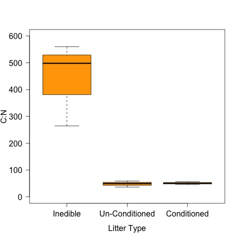
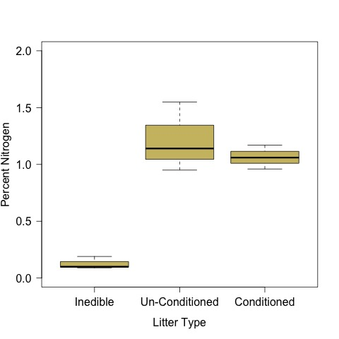
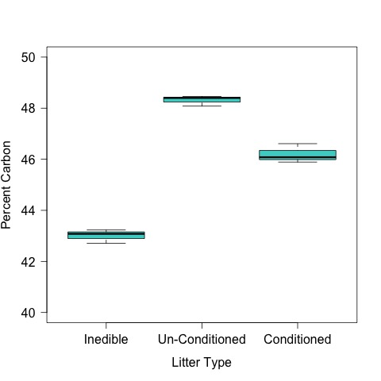

# Analysis of the litter CN data from the litter habitat experiment 
## Metadata

### File created 

* 24 May 2017

### Modified

## Description

These analyses are to evaluate the differences in nutritional quality of the different litter types in the litter habitat experiment

The description of the experiment can be found in [https://github.com/KennyPeanuts/litter_habitat_subsidy/blob/master/lab_notebook/habitat_setup_sp2017.md](https://github.com/KennyPeanuts/litter_habitat_subsidy/blob/master/lab_notebook/habitat_setup_sp2017.md)

## Import Data
   
    litter <- read.table("./data/litter_CN.csv", header = T, sep = ",")
    
### Create Factors

    type <- c(rep("COND", 3), rep("UC", 3), rep("BAG", 3))
    rep <- rep(c("A", "B", "C"), 3)

### Add Factors to data.frame

    litter <- data.frame(type, rep, litter)

### Create variable of factors in correct order for plots

    x <- factor(litter$type, levels = c("BAG", "UC", "COND"))

## Analysis

### Differences in Quality

#### CN

    par(las = 1)
    plot(CN ~ x, data = litter, ylim = c(0, 600), ylab = "C:N", xlab = "Litter Type", col = "orange", axes = F)
    axis(2)
    axis(1, c("Inedible", "Un-Conditioned", "Conditioned"), at = c(1, 2, 3))
    box()
    dev.copy(jpeg, "./output/plots/CN_by_litter.jpg")
    dev.off()

#### Percent N

    par(las = 1)
    plot(percN ~ x, data = litter, ylim = c(0, 2), ylab = "Percent Nitrogen", xlab = "Litter Type", col = "lightgoldenrod3", axes = F)
    axis(2)
    axis(1, c("Inedible", "Un-Conditioned", "Conditioned"), at = c(1, 2, 3))
    box()
    dev.copy(jpeg, "./output/plots/percN_by_litter.jpg")
    dev.off()

    percN.aov <- aov(percN ~ type, data = litter)
    summary(percN.aov)
    TukeyHSD(percN.aov)

~~~~
            Df Sum Sq Mean Sq F value   Pr(>F)    
type         2 2.0807   1.040   28.87 0.000834 ***
Residuals    6 0.2162   0.036                     

  Tukey multiple comparisons of means
    95% family-wise confidence level

Fit: aov(formula = percN ~ type, data = litter)

$type
              diff        lwr      upr     p adj
COND-BAG 0.9366667  0.4611116 1.412222 0.0022511
UC-BAG   1.0866667  0.6111116 1.562222 0.0010243
UC-COND  0.1500000 -0.3255550 0.625555 0.6215779
~~~~ 
 
#### Percent C

    par(las = 1)
    plot(percC ~ x, data = litter, ylim = c(40, 50), ylab = "Percent Carbon", xlab = "Litter Type", col = "mediumturquoise", axes = F)
    axis(2)
    axis(1, c("Inedible", "Un-Conditioned", "Conditioned"), at = c(1, 2, 3))
    box()
    dev.copy(jpeg, "./output/plots/percC_by_litter.jpg")
    dev.off()

    percC.aov <- aov(percC ~ type, data = litter)
    summary(percC.aov)
    TukeyHSD(percC.aov)

~~~~
           Df Sum Sq Mean Sq F value   Pr(>F)    
type         2  42.81  21.405   254.2 1.59e-06 ***
Residuals    6   0.51   0.084                     

> TukeyHSD(percC.aov)
  Tukey multiple comparisons of means
    95% family-wise confidence level

Fit: aov(formula = percC ~ type, data = litter)

$type
             diff      lwr      upr     p adj
COND-BAG 3.186667 2.459717 3.913617 0.0000257
UC-BAG   5.306667 4.579717 6.033617 0.0000013
UC-COND  2.120000 1.393050 2.846950 0.0002674
